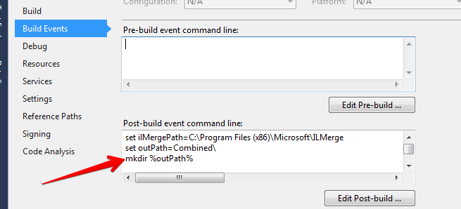
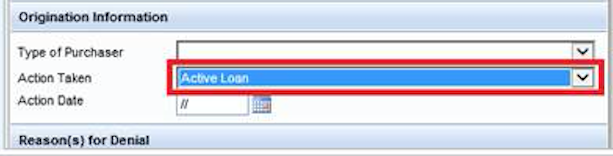

# GuaranteedRate.Sextant

Sextant is a collection of utilities for working with Ellie Mae's Encompass.
Most importantly, this library works with **BOTH** Encompass Plugins and standalone SDK Apps.

This allows developers to bake configuration, logging and performance into plugins, which will reduce development time, decrease bugs, make deployments easier and improve user experience.

While this code is general purpose and should work for everyone, the adapters for Datadog (http://datadog.com) and Loggly (http://Logger.com) will only be useful if your organization uses these tools.  Both companies offer a free tier which are sufficient for small organizations or for demo purposes.

The primary goal is to extend plugin functionality in a few key areas:
* A common and consistant configuration system using CommonDataObjects
* EncompassUtils.FieldUtils - This class dynamically loads and classifies all fieldIds on the Encompass server.
* EncompassUtils.LoanDataUtils - This class has methods for extracting all Loan Fields into a Dictionary.
* EncompassUtils.Reporting - This class has methods for common reports.
* EncompassUtils.User - This class extends the Encompass session object to easily read and write to user collections.
* Logging outside of Encompass (via Loggly) so that Logs are easy to access, searchable, and do not add load onto the Encompass server.
* Metrics (via Datadog) which allows tracking of events, latency, usage, etc without adding any load onto the Encompass server.

#### Update 17.1.0.0
This updates the Encompass SDK to 17.1.  We returned to using the Encompass nuget package.  Instructions for how to build your own package may be found in the BuildYourOwnEncompassNuget folder.   

#### Update 16.2.1.0
In this update we removed dependency to EncompassSDK nuget package which we had to create for every new release of Encompass.
Instead we are referencing 3 Encompass assemblies that are required for Sextant or any other Encompass SDK app to work. 
These assemblies are enough to resolve any encompass assemblies necessary to run your application. Quote from Ecnompass SDK documentation
> To use the EncompassObjects API, you must add a reference to three separate assemblies that are shipped with the SDK: EllieMae.Encompass.AsmResolver.dll, EllieMae.Encompass.Runtime.dll and EncompassObjects.dll. All three are found in the folder in which you installed the SDK.
> The first two of these assemblies provide the interface and implementation of the API Runtime Services, a feature that allows programs that use the EncompassObjects API to dynamically locate and load the core API DLLs at runtime.
> After adding the three assemblies as references to your project, be sure to set the Copy Local property of the EncompassObjects assembly to False.

Steps below are recommended by EllieMae, but we found them not required for the application to work
* Enable legacy security policy
* * For ConsoleApplication/WindowsService Add this to app.config:
```
<configuration>
<runtime>
<NetFx40_LegacySecurityPolicy enabled="true"/>
</runtime>
</configuration>
```
* * For Web Application add this to web.config:
```
<configuration>
<system.web>
<trust level="Full" legacyCasModel="true"/>
</system.web>
</configuration>
```
* Initialize encompass SDK by calling:
``` new EllieMae.Encompass.Runtime.RuntimeServices().Initialize(); ```
at the begining of the your application execution.


### AsyncEventReporter

This is a simple (copied from msdn) mutli-threaded queue that will send POSTs to a service asynchronously.
The calling thread adds to a Queue, and internally a Task thread will read the queue and send POSTs.

Note on queue sizes: If/when the queue is full, the writing thread will block until there is room on the queue.  Since the writing thread comes from Encompass, Encompass will seem to hang when this occurs.  Set up your queue sizes to be larger than you expect to need.

When run as an Encompass plugin, a moderate machine will drain the queue at about 600 events/minute.

### Datadog

**DatadogDirect** is an asynchronous web client that sends data directly to datadog's RESTful interface.
It is built on top of **AsyncEventReporter**

### Loggly

**Loggly** is a lightweight wrapper around **AsyncEventReporter** that gives a basic logger experience.
Under the covers it is sending data to Loggly via their REST interface.

You can't use the _log4net_ because it conflicts in some way with Encompass.

The client provides some common approximations of standard logging methods.  We can expand as needed over time.

Example:

```C#
Logger.Error(this.GetType().Name.ToString(), "This is my error");
IDictionary<string, string> fields = new Dictionary<string, string>();
fields.Add("foo", "bar");
fields.Add("foo2", "bar2");
Logger.Info(this.GetType().Name.ToString(), fields);
```

### Config

IEncompassConfig is an interface for using an Encompass CustomDataObject as a config file.

**IniConfig** is a simple implementation that treats the config file like a classic INI file.
```
[Key]=[Value]\n
# Lines starting with # are considered comments
```
(Blank lines are ignored)


**JsonEncompassConfig** is a simple implementation that uses a json config file.  

### ILMerge

To use this library in an Encompass plugin, you will need to use a free Microsoft util called ILMerge to recompile the plugin into your dll.

Download ILmerge: http://www.microsoft.com/en-us/download/details.aspx?id=17630

Create a post-build step like this:
<p  align="center">
  
</p>

```C#

set ilMergePath=C:\Program Files (x86)\Microsoft\ILMerge
set outPath=Combined\
mkdir %outPath%
 
<#
This line will combine the project DLL with any DLLs that you specify and copy it to a new 'Combined' directory.
You have to explicitly state the DLLs you want to merge because the Encompass DLLs will also be in the directory and those should not be included.
In this example we are merging Newtonsoft.Json and ReportingUtils
#>
"%iLMergePath%\ILMerge.exe" /out:%outPath%$(TargetName).dll $(TargetFileName) Newtonsoft.Json.dll GuaranteedRate.Sextant.dll /wildcards  /targetplatform:v4
 
 
<# This part is unnecessary, it will deploy your plugin to your LOCAL Encompass plugin dir so that your local-deploy will auto-deploy locally #>
 
if "$(ConfigurationName)" == "Debug" (
set targetFileWrapped= $(ProjectDir)$(OutDir)%outPath%$(TargetName).dll
xcopy %targetFileWrapped% "%USERPROFILE%\AppData\LocalLow\Apps\Ellie Mae\xIHR5EqGa7zPnRG0YpD5z4TPAB0=\EncompassData\Settings\Cache\33af7d98-3c15-497e-937e-b83215be32bc\Plugins" /f/y)
 
```

You will also need to add the following additional packages to be included in your plugin:

* json.net (newtonsoft)

# Example/Testing Programs

### FieldUtils

This is an executable utility program that will generate a file `FieldsAndDescriptions.csv` which contains fieldIds and their definition. 

### LoanUtils

This is an executable utility program that will open a loan and extract the data in json format.
The results will be written to the command line.

Useful for testing and debugging. 

## ConfigUtil

Simple test/example program for using IEncompassConfig.
Loads a config file from the Encompass Server and writes the key/value pairs to the console.

## ReportingUtils

Simple test/example program for using `Reporting.cs`.
Queries Encompass for loans last modified between a start and end date (half open) and returns a list of GUIDs.

## ReportingUtils.Functional

This is a simple test harness for the Datadog and Loggly posters.
Because this test sends data to Datadog and Loggly it is not written as a unit test.

## UserUtils

Simple example program for usin 'UserUtils.cs'.
Creates a session and prints all users, all "active" users (enabled and unlocked accounts), and all users associated within the standard "My Pipeline" working folder.

## Util.IndexFields

This is a util project to help find the boundary index for MultiValue fields that use an index.
Knowing the boundary index for multivalue fields allows faster and safer itteration.

It will show you MultiValue Index fields without known boundaries, as well as the values of the known indexes.

# Developer Notes

## Fields controlled by dropdowns - default is often null

There are many fields in Encompass that are controlled by dropdowns.
In many cases, if the value has never been changed from the default, the actual data value from the SDK will be null.

For example Field "1393" (Trans Details Current Loan Status):
<p  align="center">
  
</p>

The dropdown has a default value of "Active Loan", but if the field has never been touched, then the value will be empty.

ie you can see the drop down showing "Active Loan", but in the SDK will show:
```C#
loan.Fields["1393"].Value == "";
```
